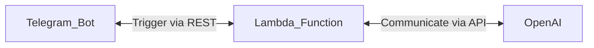

# OpenAI Chat Bot With Telegram and AWS Lambda
I made this app for easier use OpenApi, instead of open and interact with Web, now we can interact with OpenAI via Telegram
<p align="center">

</p>

### **Before Begin**
> I recommend to check pricing for Lambda because there is possibility you will getting charge for what you used
### **Diagram**

### **Requirements**
1. [Serverless Framework](https://www.serverless.com/framework/docs/getting-started) installed
2. [AWS CLI](https://docs.aws.amazon.com/cli/latest/userguide/cli-configure-quickstart.html) configured
3. [Telegram Bot](https://core.telegram.org/bots/tutorial) configured
### **Deploy With Serverless Framework**
1. Clone repository
```
git clone https://github.com/ludesdeveloper/openai_app.git 
```
2. Please update your organization inf serverless.yml file
```
org: PLEASE_CHANGE_THIS_WITH_YOUR_ORGANIZATION
app: openai-app
service: openai-app
```
3. Init & deploy serverless framework, and follow instruction
```
sls
```
### **Configure Telegram Bot Webhook**
1. Run script below, enter your lambda url and telegram bot token 
```
./set_webhook.sh
```
### **Update Lambda Environment Variable**
1. Open your AWS Lambda Console, and go to Function -> Your Function -> Configuration -> Environment Variable
2. Create new Environment Variable with key TELEGRAMAPI, and for value is your bot api token
3. Create new Environment Variable with key OPENAPIKEY, and for value is your open api key 
4. Create new Environment Variable with key TELEGRAMUSERID, and for value is your userid
### **Interraction With Bot**
1. Just ask everything, OpenAI will answer your question 
### **Destroy Application**
1. Remove all AWS stack
```
sls remove
```
### **Deploying via Serverless CI/CD**
1. Sometimes "sls deploy" getting error, and here is the [steps](https://www.serverless.com/framework/docs/guides/cicd) you can take to deploy you app
### **Other Option for Deploy**
1. You can run application locally
```
flask run
```
2. Now you can make your self online with service like [ngrok](https://ngrok.com/)
